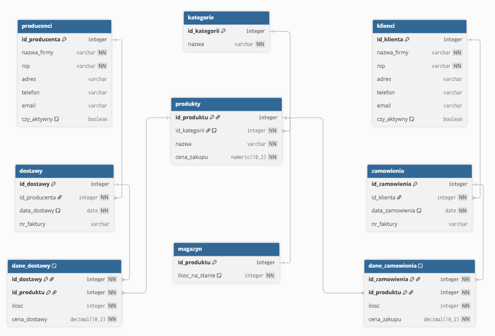

# Baza Danych Hurtowni Sprzętu Outdoorowego

## Opis Projektu
Niniejsze repozytorium zawiera projekt relacyjnej bazy danych zaimplementowanej w systemie **PostgreSQL**. Projekt ma charakter edukacyjny i symuluje system obsługi hurtowni zajmującej się dystrybucją specjalistycznego sprzętu wspinaczkowego i turystycznego.

Celem projektu było zaprojektowanie struktury danych odpornej na błędy logiczne oraz implementacja automatyzacji procesów magazynowych przy użyciu języka proceduralnego PL/pgSQL.

---

## 📜 Table of Contents

- [Schemat Bazy Danych](#-schemat-bazy-danych)
---

## Schemat Bazy Danych

### Główne Tabele:
* **Encje Główne:** `produkty`, `kategorie`, `dostawcy`, `klienci`
* **Zarządzanie Magazynem:** `magazyn` (tabela stanu)
* **Transakcje (Dostawy):** `dostawy` (nagłówek) i `dane_dostawy` (pozycje)
* **Transakcje (Zamówienia):** `zamowienia` (nagłówek) i `dane_zamowienia` (pozycje)

---

## ⚙️ Kluczowe Funkcjonalności i Logika Biznesowa

System opiera się na zaawansowanej logice zaimplementowanej bezpośrednio w bazie danych, aby zapewnić spójność i automatyzację procesów biznesowych.

### 1. Warunki Integralności Danych

Baza danych rygorystycznie przestrzega integralności danych poprzez:
* **Klucze Podstawowe (PK):** Unikalnie identyfikują każdy rekord (np. `produkt_id`, `zamowienie_id`).
* **Klucze Obce (FK):** Zapewniają spójność relacji 1:N (np. `klient_id` w tabeli `zamowienia` musi istnieć w tabeli `klienci`).
* **Ograniczenia UNIQUE:** Wymuszają unikalność danych poza kluczami głównymi (np. `nip` w tabelach `dostawcy` i `klienci`).
* **Ograniczenia CHECK:** Walidują wartości w kolumnach (np. `cena_zakupu > 0`, `ilosc_na_stanie >= 0`).
* **Ograniczenia NOT NULL:** Wymuszają zapełnienie kluczowych pól (np. `nazwa`, `email`).

### 2. Automatyzacja Magazynu (Triggery)

Rdzeniem logiki biznesowej są triggery (wyzwalacze) odpowiedzialne za automatyczne zarządzanie stanem magazynowym.

1.  **Trigger Zwiększający Stan Magazynu**
    * **Zdarzenie:** `AFTER INSERT` na tabeli `dane_dostawy`.
    * **Cel:** Automatycznie dodaje dostarczoną liczbę produktów do tabeli `magazyn` po zarejestrowaniu nowej dostawy.

2.  **Trigger Zmniejszający Stan Magazynu**
    * **Zdarzenie:** `AFTER INSERT` na tabeli `dane_zamowienia`.
    * **Cel:** Automatycznie odejmuje zamówioną liczbę produktów ze stanu w tabeli `magazyn` po złożeniu zamówienia.

3.  **Trigger Sprawdzający Dostępność Towaru**
    * **Zdarzenie:** `BEFORE INSERT` lub `BEFORE UPDATE` na tabeli `dane_zamowienia`.
    * **Cel:** Blokuje próbę dodania do zamówienia większej liczby produktów, niż jest fizycznie dostępne w magazynie.

4.  **Trigger Korygujący Stan Magazynu**
    * **Zdarzenie:** `AFTER UPDATE` lub `AFTER DELETE` na tabeli `dane_zamowienia`.
    * **Cel:** W przypadku anulowania pozycji lub zmniejszenia jej ilości w zamówieniu, trigger automatycznie przywraca odpowiednią liczbę produktów z powrotem do magazynu.

---

## 📦 Obiekty Bazy Danych

Dostęp do danych oraz operacje biznesowe są ułatwione przez dedykowane widoki, funkcje i procedury.

### Widoki (Views)

* **`AktualnyStanMagazynu`**: Dynamiczny raport pokazujący aktualną ilość na stanie dla każdego produktu, wraz z jego pełną nazwą, ceną i kategorią.
* **`BrakujaceProdukty`**: Widok filtrujący produkty, których stan magazynowy jest niski (poniżej 20 sztuk), i łączący je z danymi kontaktowymi dostawcy w celu ułatwienia procesu zamawiania.

### Funkcje (Functions)

* **`CenaZamowienia(zamowienie_id)`**: Oblicza i zwraca całkowitą wartość (sumę) dla konkretnego zamówienia na podstawie pozycji w tabeli `dane_zamowienia` (`ilosc` * `cena_zakupu`).

### Procedury (Procedures)

* **`AnulujZamowinie`**: Procedura biznesowa do usuwania pozycji z `dane_zamowienia`, która automatycznie uruchamia trigger korygujący (nr 3) w celu zwrócenia towaru na stan.
* **`RejestrujDostawe`**: Procedura biznesowa do dodawania pozycji do `dostawy` i `dane_dostawy`, która automatycznie uruchamia trigger (nr 1) w celu zwiększenia stanu magazynowego.

---

## 🔒 Bezpieczeństwo i Role Użytkowników

System definiuje trzy główne role użytkowników, aby zarządzać dostępem do danych.

| Rola | Uprawnienia (Podsumowanie) | Uzasadnienie |
| :--- | :--- | :--- |
| **Administrator** | Pełny dostęp (DDL/DML) | Zarządzanie strukturą i pełna kontrola nad bazą danych. |
| **Sprzedawca** | `SELECT`, `INSERT`, `UPDATE` (Klienci, Zamówienia)   `INSERT`, `DELETE`, `UPDATE` (Dane Zamówienia) | Tworzenie nowych klientów i obsługa pełnego cyklu zamówień. |
| **Magazynier** | `SELECT`, `INSERT`, `UPDATE` (Dostawy, Dane Dostawy)   `SELECT` (Magazyn) | Rejestrowanie nowych dostaw. Odczyt stanu magazynowego (modyfikacja odbywa się tylko przez triggery). |
| **Wszyscy** | `SELECT` (Produkty, Kategorie) | Wszystkie role potrzebują dostępu do informacji o produktach i cenach. |
